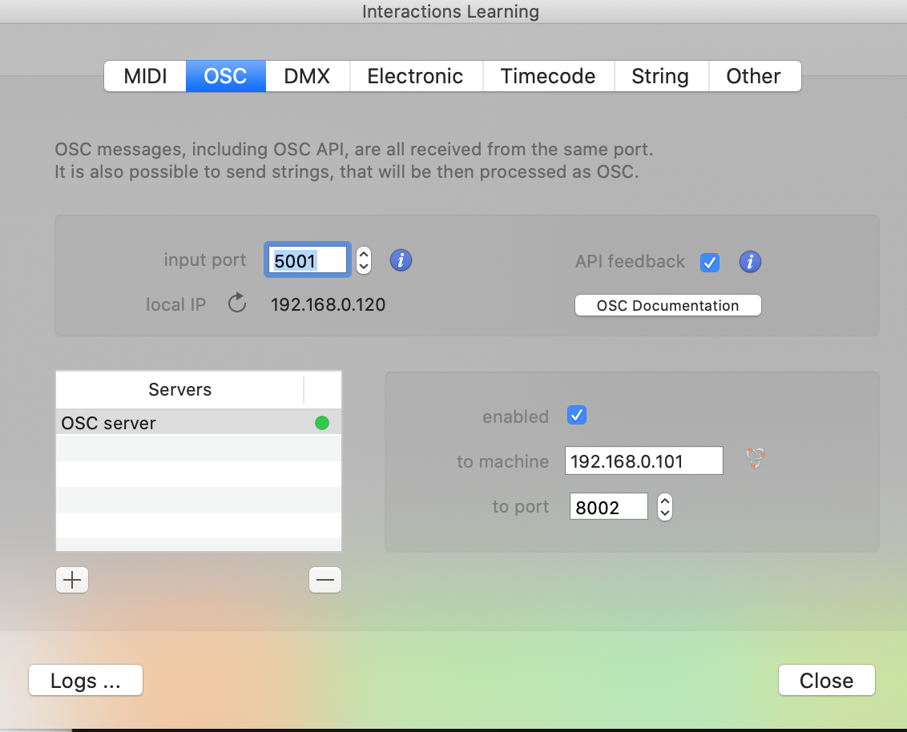
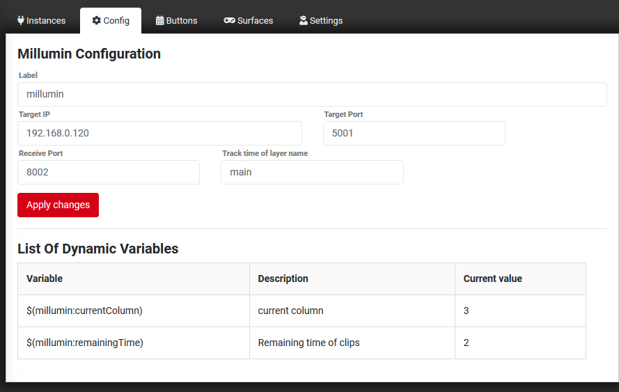

## Millumin 2, 3 and 4
Sends OSC commands to Millumin. Default port is 5000 but you can change that if needed in Millumin Interactions menu. Go to Interactions/Manage devices and from there OSC tab.

### Configuration
* Type in the IP address of the device (default 127.0.0.1).
* Type in the OSC port (default 5000).
* Type in the OSC Receive Port for feedback from Millumin (default 5001).
* Add tracked media layer names to receive timing variables and feedback.

In Millumin, go to Interactions > Manage Devices > OSC tab and configure output to send to your Companion machine's IP and the Receive Port above.

> Make sure you add the name of the layer when you would like to see remaining time

All text input fields in actions support Companion variables for dynamic control.

---

### Available Actions

#### Column Control
* Launch or Stop Column (by index or name)
* Launch Column (by index or name)
* Stop Column
* Launch Previous Column
* Launch Next Column

#### Transport
* Pause
* Play
* Play or Pause (toggle)
* Go to Time (seconds)
* Jog Time (±seconds)
* Go to Seconds from End
* Go to Timeline Segment (by name)
* Restart Media (selected layer)

#### Selected Layer Media
* Start Media (by index or name)
* Pause Media
* Play or Pause Media (toggle)
* Stop Media
* Go to Media Time (seconds)
* Go to Media Normalized Time (0–1)
* Set Media Speed

#### Selection
* Select Board (by index or name)
* Select Layer (by index or name)
* Select Light (by index or name)

#### Masters
* Set Master Video (0–1)
* Set Master Audio (0–1)
* Set Master DMX (0–1)

#### Utility
* Enter / Exit Fullscreen
* Display / Hide Test Card
* Enable / Disable Workspace
* Open Project (path)
* Save Project / Save Project As (path)
* Quit

---

### Available Feedbacks

* Progress Bar — displays a horizontal progress bar that fills left-to-right as media plays, with configurable color changes for countdown warnings (green → orange → red)

---

### Available Variables
Per tracked media layer (where `layerName` is the configured layer name):

**Formatted Timecodes (MM:SS or H:MM:SS)**
* `media_layerName_elapsed_tc` — elapsed time
* `media_layerName_duration_tc` — total duration
* `media_layerName_remaining_tc` — remaining time

**Raw Values**
* `media_layerName_elapsedTime` — elapsed time in seconds
* `media_layerName_duration` — total duration in seconds
* `media_layerName_remainingTime` — remaining time in seconds
* `media_layerName_remaining_seconds` — remaining time as whole seconds
* `media_layerName_progress` — playback progress (0–1)

**Composition**
* `currentColumnIndex` — current column number
* `currentColumnName` — current column name
* `previousColumnName` — previous column name
* `nextColumnName` — next column name

---

### Available Presets

#### Column Control
* Launch Column 1
* Previous / Next Column
* Stop Column

#### Transport
* Play
* Pause
* Play or Pause (toggle)
* Restart
* Jog -10s / +10s
* Go to 60s / 30s / 15s / 10s from End (countdown jumps)

#### Masters
* Video Blackout (0%) / Video 100%
* Audio Mute (0%) / Audio 100%

#### Utility
* Enter / Exit Fullscreen
* Display / Hide Test Card
* Save Project

#### Per Tracked Layer
* Column Name / Column Index (current column display)
* Elapsed Time (formatted timecode)
* Remaining Time (formatted timecode)
* TRT (duration + remaining with countdown progress bar)
* Progress Bar (remaining time with color-changing progress bar)
